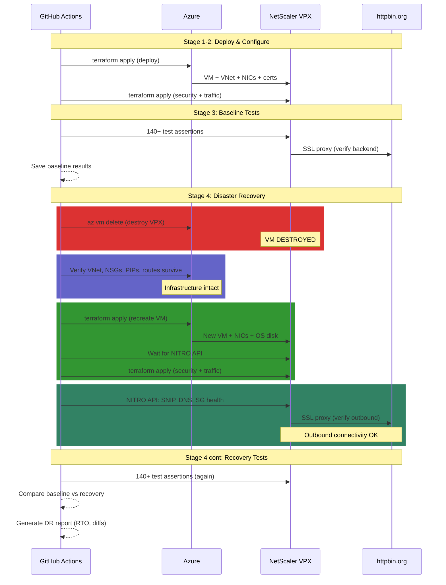

# Disaster Recovery Testing: How Fast Can You Rebuild Your Load Balancer From Code?

*Your IaC promises reproducibility. This pipeline proves it.*

---

Everyone says "we can rebuild from code." Nobody tests it.

When your load balancer dies at 2am, you discover the Terraform state is stale, the Azure marketplace terms need re-acceptance, or the NITRO API takes 3 minutes to warm up after boot. Your "15-minute RTO" is actually 45 minutes of fumbling, and you have no evidence it was correctly configured when it came back.

This repo doesn't just deploy and test a NetScaler VPX — it **destroys it mid-pipeline, rebuilds from Terraform, and proves the recovered appliance is identical to the original**. Every pipeline run measures RTO to the second and compares 140+ test assertions before and after.

## The DR Test Cycle



The pipeline runs 4 stages:

| Stage | What Happens | Duration |
|-------|-------------|----------|
| **Deploy** | VNet, NSGs, VPX VM, public IPs, TLS certs | ~5 min |
| **Configure** | Security hardening, traffic config, certs, headers, bot blocking | ~3 min |
| **Baseline** | Run full test suite, save results as artifact | ~5 min |
| **DR Test** | Destroy → validate infra → rebuild → connectivity check → retest → compare | ~15 min |

Total pipeline: ~30 minutes. The DR stage alone measures your actual RTO.

## What Gets Measured

The DR stage records timestamps at each phase boundary and produces a timing breakdown:

```
================================================================
  DISASTER RECOVERY REPORT
  2026-03-11 14:30:00 UTC
================================================================

  TIMING
  ------------------------------------------------------------
  Phase                          Actual   Threshold   Status
  ------------------------------------------------------------
  VM Destruction:                  42s
  VM Recovery (terraform):      4m 18s      6m 00s       OK
  NITRO API Warmup:             2m 30s      5m 00s       OK
  Config Recovery:              1m 05s      2m 00s       OK
  Test Verification:            3m 12s
  ------------------------------------------------------------
  RTO (destroy -> configured):  8m 35s     10m 00s       OK
  Total DR Cycle:              11m 47s

  DATA PLANE SATURATION
  --------------------------------------------------
  Total Probes:                340
  Successful (200):            92
  Failed:                      248
  Availability:                27.1%
  Measured Downtime:           8m 16s
  Time to First Recovery:      18s
  Mid-rebuild access:          None (clean outage window)

  TEST COMPARISON
  --------------------------------------------------
  Baseline:        143 passed, 0 failed, 2 warnings
  Recovery:        143 passed, 0 failed, 2 warnings
  Match:           IDENTICAL

  Quality Gates:   0 breaches (baseline: 0)
  --------------------------------------------------
  DR RESULT: PASS — Full recovery verified within thresholds
================================================================
```

| Metric | What It Measures | Threshold | Why It Matters |
|--------|-----------------|-----------|---------------|
| **VM Destruction** | Time to delete VM + NICs + disk | — | Simulates the failure event |
| **VM Recovery** | `terraform apply` to recreate VM from state | 6 min | Core provisioning time |
| **NITRO API Warmup** | Time from VM boot to API responding | 5 min | VPX-specific — appliances aren't instant |
| **Config Recovery** | Security + traffic terraform apply | 2 min | Full configuration restoration |
| **RTO** | Destruction to fully configured | 10 min | Your actual recovery time objective |
| **Test Verification** | Full test suite after recovery | — | Proves correctness, not just existence |
| **Saturation Downtime** | Data plane outage measured by background probes | — | Actual user-facing downtime |

Thresholds are configurable per-run via CLI arguments to `dr-report.py`. Defaults are generous (10-minute RTO) — tighten them as you establish baselines. Any breach fails the pipeline.

## RTO Quality Gates

The DR report doesn't just measure timing — it **gates on it**. If any phase exceeds its threshold, the pipeline fails even if all tests pass:

```bash
python3 scripts/dr-report.py \
    --rto-threshold 600 \          # 10 min total RTO
    --vm-recovery-threshold 360 \  # 6 min VM provisioning
    --api-warmup-threshold 300 \   # 5 min NITRO API boot
    --config-threshold 120         # 2 min security + traffic
```

A passing pipeline proves: (1) tests are identical, (2) no quality gates breached, and (3) recovery completed within your SLA.

## Data Plane Saturation — Measuring the Real Downtime

The pipeline runs a background probe throughout the DR cycle — sending an HTTPS request to the VIP every 2 seconds. This measures the actual downtime as users would experience it:

```
  Started: probe hits VIP every 2s (expect 200)
  Phase 1: Destroy VM → probes start failing (000/connection refused)
  ...8 minutes of failures...
  Phase 4: Config applied → first successful probe
  Stopped: analyze results
```

The probe CSV records `epoch,http_status,response_ms` for every request. The DR report analyzes it:

| Metric | What It Measures |
|--------|-----------------|
| **Total Probes** | How many requests were attempted during the DR cycle |
| **Availability** | Percentage of successful (200) probes |
| **Measured Downtime** | First failure to first recovery — the real outage window |
| **Time to First Recovery** | Last failure to first success — how quickly the VIP comes back |
| **Mid-rebuild Access** | Probes that succeeded DURING the outage — a security concern if the VIP was partially accessible |

The saturation probe measures downtime from the outside — the way your users experience it. The RTO measures how long recovery takes from the inside. Both numbers matter, and they won't always agree.

## Baseline Comparison — The Key Innovation

Most DR tests check "does it come back up?" This pipeline checks **"does it come back identical?"**

The same 140+ test assertions run before destruction (baseline) and after recovery. The DR report compares them test-by-test. If the HTTP profile had `http2maxconcurrentstreams = 128` before and has `100` after, that's a recovery failure — even though the VPX is "up."

```bash
# If any test result differs between baseline and recovery, the pipeline fails
if baseline["passed"] != recovery["passed"] or len(diffs) > 0:
    print("DR RESULT: FAIL")
```

The comparison catches subtle issues that "is it UP?" checks miss:
- Cipher suite order changed
- Security header policy not rebound after recreation
- TCP profile defaults instead of hardened values
- Bot blocking patset missing entries

## What Gets Destroyed

The pipeline uses `az vm delete` — not `terraform destroy`. This is deliberate:

**`terraform destroy`** removes everything: VNet, subnets, NSGs, public IPs, storage. That's a full rebuild test, not a recovery test.

**`az vm delete`** removes only the VM, NICs, and OS disk. The network infrastructure, public IPs, storage account, and Terraform state survive — exactly like a real VM failure. Terraform detects the missing VM and recreates it with the same config.

```yaml
# Delete VM (forces NIC detachment, deletes OS disk)
az vm delete --name vm-vpx --resource-group "$RG" --yes --force-deletion true

# Also clean up NICs and disk (Azure doesn't auto-delete them)
az network nic delete --name nic-vpx-mgmt --resource-group "$RG"
az network nic delete --name nic-vpx-client --resource-group "$RG"
az disk delete --name osdisk-vpx --resource-group "$RG" --yes
```

After deletion, `terraform apply` sees the missing resources in state and recreates them — the same way you'd recover in production.

## What Survives — Infrastructure Validation

Before rebuilding, the pipeline verifies that the network infrastructure survived the VM destruction. This catches a class of failures where cloud provider cleanup cascades delete more than expected:

```
  DR Phase 1b — Infrastructure Survival Check

  VM is destroyed. Verifying network infrastructure survived...

  --- VNet & Subnets ---
  PASS  VNet exists (vnet-vpx)                          vnet-vpx
  PASS  VNet address space                              10.254.0.0/16
  PASS  Management subnet (snet-vpx-mgmt)               10.254.10.0/24
  PASS  Client subnet (snet-vpx-client)                  10.254.11.0/24

  --- Network Security Groups ---
  PASS  Management NSG exists                            nsg-management
  PASS  Client NSG exists                                nsg-client
  PASS  Mgmt NSG rule (SSH+HTTP+HTTPS)                   ports: 22,80,443
  PASS  Client NSG rule (HTTP+HTTPS)                     ports: 80,443
  PASS  Mgmt subnet → NSG association                    associated
  PASS  Client subnet → NSG association                  associated

  --- Public IPs ---
  PASS  Management public IP allocated                   20.x.x.x
  PASS  VIP public IP allocated                          20.x.x.x
  PASS  Management PIP SKU                               Standard
  PASS  VIP PIP SKU                                      Standard

  --- Storage ---
  PASS  Storage account exists                           stvpxdiagXXXXXXXX

  --- Resource Tags ---
  PASS  Tags: vnet-vpx                                   project=netscaler-vpx, managed_by=terraform
  PASS  Tags: nsg-management                             project=netscaler-vpx, managed_by=terraform
  PASS  Tags: nsg-client                                 project=netscaler-vpx, managed_by=terraform
  PASS  Tags: pip-vpx-mgmt                               project=netscaler-vpx, managed_by=terraform
  PASS  Tags: pip-vpx-vip                                project=netscaler-vpx, managed_by=terraform
  PASS  Tags: stvpxdiagXXXXXXXX                          project=netscaler-vpx, managed_by=terraform

  --- Route Tables ---
  PASS  Mgmt subnet routing                             using Azure default routes
  PASS  Client subnet routing                            using Azure default routes

  --- VM Confirmed Absent ---
  PASS  VM is destroyed                                  ABSENT
  PASS  Management NIC is destroyed                      ABSENT
  PASS  Client NIC is destroyed                          ABSENT

  ===========================================
  Infrastructure: 26 passed, 0 failed
  Network infrastructure intact — ready to rebuild
  ===========================================
```

| Check | What It Validates | Why It Matters |
|-------|------------------|---------------|
| VNet + subnets | Address space and CIDR blocks intact | VM recreation needs the same network topology |
| NSGs + rules | Firewall rules survive VM deletion | Without NSG rules, rebuilt VM is either unreachable or overexposed |
| NSG associations | NSGs still bound to subnets | Unbound NSGs = no firewall on rebuilt NICs |
| Public IPs | Same IPs still allocated, Standard SKU | IP change = DNS/firewall updates, Standard required for availability zones |
| Storage | Diagnostic storage survives | Terraform state references this — missing storage breaks the apply |
| Resource tags | `project`, `managed_by`, `pipeline_run` tags on surviving resources | Tags lost = broken cost tracking, compliance, automation metadata |
| Routes | Routing tables intact | Custom routes lost = traffic blackholed after rebuild |
| VM/NIC absent | Confirms deletion was complete | Partial deletion blocks Terraform from recreating resources |

If any infrastructure check fails, the pipeline warns but continues — the rebuild may still succeed if Terraform can recreate the missing components.

## Outbound Connectivity — Can the VPX Reach the Internet?

After rebuilding and reconfiguring, the pipeline validates that the VPX can actually reach external services. A VPX that boots and accepts NITRO API calls isn't necessarily functional — it needs working DNS, outbound routing through the SNIP, and healthy backend connections.

```
  DR Phase 4b — VPX Outbound Connectivity

  --- Azure NIC IP Assignment ---
  PASS  Mgmt NIC private IP                              10.254.10.10
  PASS  Mgmt NIC allocation method                       Static
  PASS  Client NIC SNIP private IP                       10.254.11.10
  PASS  Client NIC VIP private IP                        10.254.11.11
  PASS  Client NIC VIP allocation method                 Static
  PASS  Mgmt NIC → Public IP                             associated
  PASS  Client NIC VIP → Public IP                       associated

  --- SNIP Configuration ---
  PASS  SNIP exists and enabled                          ENABLED
  PASS  SNIP address                                     10.254.11.10
  PASS  NSIP address (NITRO)                             10.254.10.10

  --- Backend Connectivity (httpbin.org) ---
  PASS  Service group sg_backend state                   UP
  PASS  Backend members healthy                          1/1 UP

  --- LB vServer Health ---
  PASS  LB vserver lb_vsrv_https state                   UP
  PASS  LB vserver health                                100

  --- Live Traffic Test ---
  PASS  VIP HTTPS /get (end-to-end)                      200
  PASS  VIP HTTP→HTTPS redirect                          301
  PASS  Backend proxy response body                      httpbin.org response verified

  --- VPX DNS Resolution ---
  PASS  DNS nameservers configured                       168.63.129.16

  ===========================================
  Connectivity: 18 passed, 0 failed
  VPX fully operational — outbound connectivity verified
  ===========================================
```

Each check proves a different layer of the network path:

| Check | What It Proves | Failure Means |
|-------|---------------|---------------|
| NIC private IPs | Static IPs (10.254.10.10, .11.10, .11.11) match expected | Azure assigned wrong IPs — VPX config mismatch |
| NIC allocation | IP assignment is Static, not Dynamic | Dynamic fallback = IPs may change on next reboot |
| NIC → PIP | Public IPs re-associated to recreated NICs | VPX unreachable from internet |
| NSIP (NITRO) | Management IP the VPX reports matches Azure NIC | VPX internal config diverges from Azure network |
| SNIP enabled | Subnet IP for outbound traffic is configured | VPX can't initiate connections to backends |
| SNIP address | Correct IP on the client subnet | Wrong subnet = routing failure |
| Service group UP | DNS resolved httpbin.org, TCP+TLS handshake succeeded | Backend unreachable — DNS, firewall, or TLS issue |
| Backend members | Individual server health monitors passing | Health check failure despite group existing |
| LB vserver UP | Full load balancer chain is functional | Config binding issue between vserver and service group |
| LB health 100% | All backends healthy | Partial failure — some backends down |
| VIP HTTPS 200 | End-to-end: client → public IP → VPX → httpbin.org → response | Complete traffic path broken |
| HTTP→HTTPS redirect | Redirect policy rebound after recreation | Policy binding lost during recovery |
| Response body | httpbin.org JSON returned through proxy | VPX serves a response but it's not from the backend |
| DNS nameservers | VPX has DNS configured for name resolution | Can't resolve backend hostnames |

The service group health check (`sg_backend` state: UP) is the most valuable single test. It proves the VPX can resolve `httpbin.org` via DNS, establish a TCP connection on port 443, complete a TLS handshake, and pass the health monitor — all through Azure's network stack via the SNIP. If the service group is UP, the VPX has working outbound connectivity.

## Azure Resource Tags — Pipeline Traceability

Every Azure resource is tagged with 5 labels:

```hcl
locals {
  common_tags = {
    project      = "netscaler-vpx"
    environment  = "dr-test"
    managed_by   = "terraform"
    pipeline_run = var.pipeline_run_id   # GitHub Actions run ID
    repository   = "netscaler-policy-as-code"
  }
}
```

Tags serve three purposes in the DR pipeline:

1. **Survival validation** — After VM destruction, Phase 1b checks that tags on surviving resources (VNet, NSGs, public IPs, storage) are intact. Tags lost during VM deletion indicate unexpected cascade behavior.

2. **Pipeline traceability** — The `pipeline_run` tag links every Azure resource to the specific GitHub Actions run that created it. After recovery, the recreated VM and NICs carry the same `pipeline_run` tag as the surviving infrastructure.

3. **Cost tracking** — The `project` and `environment` tags enable Azure Cost Management filtering. Every DR test run's cost is attributable to `netscaler-vpx/dr-test`.

## TLS Certificate Chain Validation

After recovery, Terraform regenerates the wildcard certificate (`*.lab.local`) and Lab CA. The test suite validates not just cert properties (key size, subject, expiry) but **full chain trust**:

1. `openssl verify -CAfile CA.pem leaf.pem` — CA actually signed the leaf cert
2. `openssl s_client -verify_return_error` — client-perspective chain validation (return code 0)
3. CA has `CA:TRUE` basic constraint — confirms the CA cert is actually a CA

This catches subtle recovery failures where the cert exists but the chain is broken — the VPX would serve HTTPS but clients would get untrusted certificate warnings.

## What Can Go Wrong

The DR test surfaces real recovery risks that you'd otherwise discover at 2am:

**Terraform state drift**: Someone clicked in the Azure portal and changed a setting. Terraform state says the old value, the apply succeeds, but the VPX has config that wasn't in your code.

**Marketplace terms**: Azure marketplace images require terms acceptance. If your service principal changes or the image version updates, the apply fails with a cryptic "MarketplacePurchaseEligibilityFailed" error.

**NITRO API warmup**: The VPX VM boots in ~2 minutes, but the NITRO API (management interface) takes another 1-3 minutes to become responsive. If your automation doesn't wait, the security and traffic terraform fails with connection refused.

**Certificate regeneration**: Terraform's TLS provider generates new certs when the resources are recreated. The wildcard cert has different bytes but the same CN (`*.lab.local`). Tests pass because they validate cert properties (key size, issuer, chain depth), not the exact cert content. This is actually correct DR behavior — you want fresh certs, not restored ones that might be compromised.

## How the Test Suite Works

The test suite (`scripts/run-comprehensive-tests.sh`) queries the VPX NITRO API and makes live HTTP requests across 22 sections:

- **Configuration validation** (12 sections): Every feature, mode, profile, timeout, cert, vserver, policy verified via NITRO API
- **Functional testing** (2 sections): Live HTTP requests through VIP, security header validation
- **Security testing** (2 sections): TLS probe + 9 attack tool simulations
- **Performance testing** (6 sections): Single-request timing, P50/P95/P99 percentiles, concurrent load, burst, mixed methods

9 quality gates fail the pipeline on critical thresholds (VIP down, TLS broken, P95 > 5s, <95% success under load).

## Quick Start

### Prerequisites

- Azure subscription with a service principal (`Contributor` role)
- Self-hosted GitHub Actions runner with: Terraform, Azure CLI, Python 3, OpenSSL, curl
- Secrets configured: `ARM_CLIENT_ID`, `ARM_CLIENT_SECRET`, `ARM_TENANT_ID`, `ARM_SUBSCRIPTION_ID`, `NSROOT_PASSWORD`, `RPC_PASSWORD`

### Run the DR Test

1. Go to **Actions** → **Disaster Recovery Test** → **Run workflow**
2. Watch the 4 stages execute (~30 minutes total)
3. The DR report appears in the Stage 4 logs with RTO timing and test comparison
4. Full report uploaded to Azure Blob Storage (`vpx-logs/dr-test-{run_id}/`)

### What a Passing DR Test Proves

- Your Terraform code can recreate the appliance from state
- Network infrastructure (VNet, NSGs, IPs, tags) survives VM destruction
- NIC IP assignments are identical after recreation (static IPs verified)
- TLS certificate chain is trusted after cert regeneration
- Security hardening is fully restored (not just defaults)
- Traffic configuration is identical (certs, headers, bot blocking, cipher suites)
- The VIP serves traffic and passes all performance gates
- Your actual RTO is measured and within thresholds
- Data plane downtime window is quantified

## Project Structure

```
.github/workflows/
  deploy.yml                       3-stage pipeline (deploy → configure → test & report)
  dr-test.yml                      4-stage DR pipeline (deploy → configure → baseline → destroy/recover/retest)

terraform/
  deploy/                          VNet, subnets, NSGs, VPX VM, NICs, public IPs, TLS certs, storage
  security/                        Features, modes, system params, HTTP/TCP profiles, timeouts
  traffic/                         Certs, backend, LB vservers, SSL, headers, bot blocking, logging

scripts/
  run-comprehensive-tests.sh       22 test sections, 9 quality gates, 140+ assertions, TLS chain validation
  dr-report.py                     DR report — timing thresholds + saturation analysis + baseline comparison
  dr-saturation.sh                 Background VIP probe — measures data plane downtime during DR cycle
```

## Security

- **TLS**: 1.2/1.3 only, 4 AEAD cipher suites
- **Headers**: HSTS (1 year), CSP, X-Frame-Options DENY, X-Content-Type-Options, Referrer-Policy, Permissions-Policy
- **Bot blocking**: 9 attack tool signatures → HTTP 403
- **VPX hardening**: Strong passwords, session timeout, HTTP/TCP profile hardening, SYN flood protection
- **Credentials**: All passwords via GitHub Secrets, TLS certs auto-generated — zero secrets in the repo
