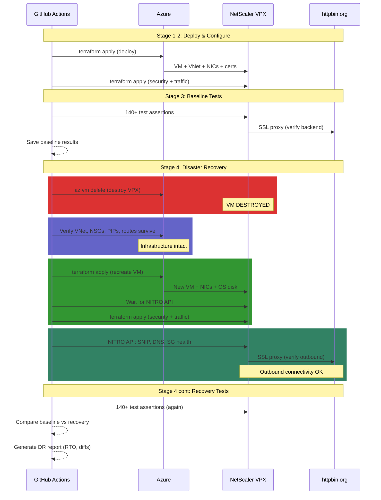

# Disaster Recovery Testing: How Fast Can You Rebuild Your Load Balancer From Code?

*Your IaC promises reproducibility. This pipeline proves it.*

---

Everyone says "we can rebuild from code." Nobody tests it.

When your load balancer dies at 2am, you discover the Terraform state is stale, the Azure marketplace terms need re-acceptance, or the NITRO API takes 3 minutes to warm up after boot. Your "15-minute RTO" is actually 45 minutes of fumbling, and you have no evidence it was correctly configured when it came back.

This repo doesn't just deploy and test a NetScaler VPX — it **destroys it mid-pipeline, rebuilds from Terraform, and proves the recovered appliance is identical to the original**. Every pipeline run measures RTO to the second and compares 140+ test assertions before and after.

## The DR Test Cycle



The pipeline runs 4 stages:

| Stage | What Happens | Duration |
|-------|-------------|----------|
| **Deploy** | VNet, NSGs, VPX VM, public IPs, TLS certs | ~5 min |
| **Configure** | Security hardening, traffic config, certs, headers, bot blocking | ~3 min |
| **Baseline** | Run full test suite, save results as artifact | ~5 min |
| **DR Test** | Destroy → validate infra → rebuild → connectivity check → retest → compare | ~15 min |

Total pipeline: ~30 minutes. The DR stage alone measures your actual RTO.

## What Gets Measured

The DR stage records timestamps at each phase boundary and produces a timing breakdown:

```
================================================================
  DISASTER RECOVERY REPORT
  2026-03-11 14:30:00 UTC
================================================================

  TIMING
  --------------------------------------------------
  VM Destruction:                0m 42s
  VM Recovery (terraform):      4m 18s
  NITRO API Warmup:             2m 30s
  Config Recovery:              1m 05s
  Test Verification:            3m 12s
  --------------------------------------------------
  RTO (destroy -> configured):  8m 35s
  Total DR Cycle:               11m 47s

  TEST COMPARISON
  --------------------------------------------------
  Baseline:        140 passed, 0 failed, 2 warnings
  Recovery:        140 passed, 0 failed, 2 warnings
  Match:           IDENTICAL

  Quality Gates:   0 breaches (baseline: 0)
  --------------------------------------------------
  DR RESULT: PASS — Full recovery verified
================================================================
```

| Metric | What It Measures | Why It Matters |
|--------|-----------------|---------------|
| **VM Destruction** | Time to delete VM + NICs + disk | Simulates the failure event |
| **VM Recovery** | `terraform apply` to recreate VM from state | Core provisioning time |
| **NITRO API Warmup** | Time from VM boot to API responding | VPX-specific — appliances aren't instant |
| **Config Recovery** | Security + traffic terraform apply | Full configuration restoration |
| **RTO** | Destruction to fully configured | Your actual recovery time objective |
| **Test Verification** | Full test suite after recovery | Proves correctness, not just existence |

## Baseline Comparison — The Key Innovation

Most DR tests check "does it come back up?" This pipeline checks **"does it come back identical?"**

The same 140+ test assertions run before destruction (baseline) and after recovery. The DR report compares them test-by-test. If the HTTP profile had `http2maxconcurrentstreams = 128` before and has `100` after, that's a recovery failure — even though the VPX is "up."

```bash
# If any test result differs between baseline and recovery, the pipeline fails
if baseline["passed"] != recovery["passed"] or len(diffs) > 0:
    print("DR RESULT: FAIL")
```

The comparison catches subtle issues that "is it UP?" checks miss:
- Cipher suite order changed
- Security header policy not rebound after recreation
- TCP profile defaults instead of hardened values
- Bot blocking patset missing entries

## What Gets Destroyed

The pipeline uses `az vm delete` — not `terraform destroy`. This is deliberate:

**`terraform destroy`** removes everything: VNet, subnets, NSGs, public IPs, storage. That's a full rebuild test, not a recovery test.

**`az vm delete`** removes only the VM, NICs, and OS disk. The network infrastructure, public IPs, storage account, and Terraform state survive — exactly like a real VM failure. Terraform detects the missing VM and recreates it with the same config.

```yaml
# Delete VM (forces NIC detachment, deletes OS disk)
az vm delete --name vm-vpx --resource-group "$RG" --yes --force-deletion true

# Also clean up NICs and disk (Azure doesn't auto-delete them)
az network nic delete --name nic-vpx-mgmt --resource-group "$RG"
az network nic delete --name nic-vpx-client --resource-group "$RG"
az disk delete --name osdisk-vpx --resource-group "$RG" --yes
```

After deletion, `terraform apply` sees the missing resources in state and recreates them — the same way you'd recover in production.

## What Survives — Infrastructure Validation

Before rebuilding, the pipeline verifies that the network infrastructure survived the VM destruction. This catches a class of failures where cloud provider cleanup cascades delete more than expected:

```
  DR Phase 1b — Infrastructure Survival Check

  VM is destroyed. Verifying network infrastructure survived...

  --- VNet & Subnets ---
  PASS  VNet exists (vnet-vpx)                          vnet-vpx
  PASS  VNet address space                              10.254.0.0/16
  PASS  Management subnet (snet-vpx-mgmt)               10.254.10.0/24
  PASS  Client subnet (snet-vpx-client)                  10.254.11.0/24

  --- Network Security Groups ---
  PASS  Management NSG exists                            nsg-management
  PASS  Client NSG exists                                nsg-client
  PASS  Mgmt NSG rule (SSH+HTTP+HTTPS)                   ports: 22,80,443
  PASS  Client NSG rule (HTTP+HTTPS)                     ports: 80,443
  PASS  Mgmt subnet → NSG association                    associated
  PASS  Client subnet → NSG association                  associated

  --- Public IPs ---
  PASS  Management public IP allocated                   20.x.x.x
  PASS  VIP public IP allocated                          20.x.x.x
  PASS  Management PIP SKU                               Standard
  PASS  VIP PIP SKU                                      Standard

  --- Storage ---
  PASS  Storage account exists                           stvpxdiagXXXXXXXX

  --- Route Tables ---
  PASS  Mgmt subnet routing                             using Azure default routes
  PASS  Client subnet routing                            using Azure default routes

  --- VM Confirmed Absent ---
  PASS  VM is destroyed                                  ABSENT
  PASS  Management NIC is destroyed                      ABSENT
  PASS  Client NIC is destroyed                          ABSENT

  ===========================================
  Infrastructure: 20 passed, 0 failed
  Network infrastructure intact — ready to rebuild
  ===========================================
```

| Check | What It Validates | Why It Matters |
|-------|------------------|---------------|
| VNet + subnets | Address space and CIDR blocks intact | VM recreation needs the same network topology |
| NSGs + rules | Firewall rules survive VM deletion | Without NSG rules, rebuilt VM is either unreachable or overexposed |
| NSG associations | NSGs still bound to subnets | Unbound NSGs = no firewall on rebuilt NICs |
| Public IPs | Same IPs still allocated, Standard SKU | IP change = DNS/firewall updates, Standard required for availability zones |
| Storage | Diagnostic storage survives | Terraform state references this — missing storage breaks the apply |
| Routes | Routing tables intact | Custom routes lost = traffic blackholed after rebuild |
| VM/NIC absent | Confirms deletion was complete | Partial deletion blocks Terraform from recreating resources |

If any infrastructure check fails, the pipeline warns but continues — the rebuild may still succeed if Terraform can recreate the missing components.

## Outbound Connectivity — Can the VPX Reach the Internet?

After rebuilding and reconfiguring, the pipeline validates that the VPX can actually reach external services. A VPX that boots and accepts NITRO API calls isn't necessarily functional — it needs working DNS, outbound routing through the SNIP, and healthy backend connections.

```
  DR Phase 4b — VPX Outbound Connectivity

  --- SNIP Configuration ---
  PASS  SNIP exists and enabled                          ENABLED
  PASS  SNIP address                                     10.254.11.10

  --- Backend Connectivity (httpbin.org) ---
  PASS  Service group sg_backend state                   UP
  PASS  Backend members healthy                          1/1 UP

  --- LB vServer Health ---
  PASS  LB vserver lb_vsrv_https state                   UP
  PASS  LB vserver health                                100

  --- Live Traffic Test ---
  PASS  VIP HTTPS /get (end-to-end)                      200
  PASS  VIP HTTP→HTTPS redirect                          301
  PASS  Backend proxy response body                      httpbin.org response verified

  --- VPX DNS Resolution ---
  PASS  DNS nameservers configured                       168.63.129.16

  ===========================================
  Connectivity: 10 passed, 0 failed
  VPX fully operational — outbound connectivity verified
  ===========================================
```

Each check proves a different layer of the network path:

| Check | What It Proves | Failure Means |
|-------|---------------|---------------|
| SNIP enabled | Subnet IP for outbound traffic is configured | VPX can't initiate connections to backends |
| SNIP address | Correct IP on the client subnet | Wrong subnet = routing failure |
| Service group UP | DNS resolved httpbin.org, TCP+TLS handshake succeeded | Backend unreachable — DNS, firewall, or TLS issue |
| Backend members | Individual server health monitors passing | Health check failure despite group existing |
| LB vserver UP | Full load balancer chain is functional | Config binding issue between vserver and service group |
| LB health 100% | All backends healthy | Partial failure — some backends down |
| VIP HTTPS 200 | End-to-end: client → public IP → VPX → httpbin.org → response | Complete traffic path broken |
| HTTP→HTTPS redirect | Redirect policy rebound after recreation | Policy binding lost during recovery |
| Response body | httpbin.org JSON returned through proxy | VPX serves a response but it's not from the backend |
| DNS nameservers | VPX has DNS configured for name resolution | Can't resolve backend hostnames |

The service group health check (`sg_backend` state: UP) is the most valuable single test. It proves the VPX can resolve `httpbin.org` via DNS, establish a TCP connection on port 443, complete a TLS handshake, and pass the health monitor — all through Azure's network stack via the SNIP. If the service group is UP, the VPX has working outbound connectivity.

## What Can Go Wrong

The DR test surfaces real recovery risks that you'd otherwise discover at 2am:

**Terraform state drift**: Someone clicked in the Azure portal and changed a setting. Terraform state says the old value, the apply succeeds, but the VPX has config that wasn't in your code.

**Marketplace terms**: Azure marketplace images require terms acceptance. If your service principal changes or the image version updates, the apply fails with a cryptic "MarketplacePurchaseEligibilityFailed" error.

**NITRO API warmup**: The VPX VM boots in ~2 minutes, but the NITRO API (management interface) takes another 1-3 minutes to become responsive. If your automation doesn't wait, the security and traffic terraform fails with connection refused.

**Certificate regeneration**: Terraform's TLS provider generates new certs when the resources are recreated. The wildcard cert has different bytes but the same CN (`*.lab.local`). Tests pass because they validate cert properties (key size, issuer, chain depth), not the exact cert content. This is actually correct DR behavior — you want fresh certs, not restored ones that might be compromised.

## How the Test Suite Works

The test suite (`scripts/run-comprehensive-tests.sh`) queries the VPX NITRO API and makes live HTTP requests across 22 sections:

- **Configuration validation** (12 sections): Every feature, mode, profile, timeout, cert, vserver, policy verified via NITRO API
- **Functional testing** (2 sections): Live HTTP requests through VIP, security header validation
- **Security testing** (2 sections): TLS probe + 9 attack tool simulations
- **Performance testing** (6 sections): Single-request timing, P50/P95/P99 percentiles, concurrent load, burst, mixed methods

9 quality gates fail the pipeline on critical thresholds (VIP down, TLS broken, P95 > 5s, <95% success under load).

## Quick Start

### Prerequisites

- Azure subscription with a service principal (`Contributor` role)
- Self-hosted GitHub Actions runner with: Terraform, Azure CLI, Python 3, OpenSSL, curl
- Secrets configured: `ARM_CLIENT_ID`, `ARM_CLIENT_SECRET`, `ARM_TENANT_ID`, `ARM_SUBSCRIPTION_ID`, `NSROOT_PASSWORD`, `RPC_PASSWORD`

### Run the DR Test

1. Go to **Actions** → **Disaster Recovery Test** → **Run workflow**
2. Watch the 4 stages execute (~30 minutes total)
3. The DR report appears in the Stage 4 logs with RTO timing and test comparison
4. Full report uploaded to Azure Blob Storage (`vpx-logs/dr-test-{run_id}/`)

### What a Passing DR Test Proves

- Your Terraform code can recreate the appliance from state
- Security hardening is fully restored (not just defaults)
- Traffic configuration is identical (certs, headers, bot blocking, cipher suites)
- The VIP serves traffic and passes all performance gates
- Your actual RTO is measured, not estimated

## Project Structure

```
.github/workflows/
  deploy.yml                       3-stage pipeline (deploy → configure → test & report)
  dr-test.yml                      4-stage DR pipeline (deploy → configure → baseline → destroy/recover/retest)

terraform/
  deploy/                          VNet, subnets, NSGs, VPX VM, NICs, public IPs, TLS certs, storage
  security/                        Features, modes, system params, HTTP/TCP profiles, timeouts
  traffic/                         Certs, backend, LB vservers, SSL, headers, bot blocking, logging

scripts/
  run-comprehensive-tests.sh       22 test sections, 9 quality gates, 140+ assertions
  dr-report.py                     DR report — timing metrics + baseline vs recovery comparison
```

## Security

- **TLS**: 1.2/1.3 only, 4 AEAD cipher suites
- **Headers**: HSTS (1 year), CSP, X-Frame-Options DENY, X-Content-Type-Options, Referrer-Policy, Permissions-Policy
- **Bot blocking**: 9 attack tool signatures → HTTP 403
- **VPX hardening**: Strong passwords, session timeout, HTTP/TCP profile hardening, SYN flood protection
- **Credentials**: All passwords via GitHub Secrets, TLS certs auto-generated — zero secrets in the repo
