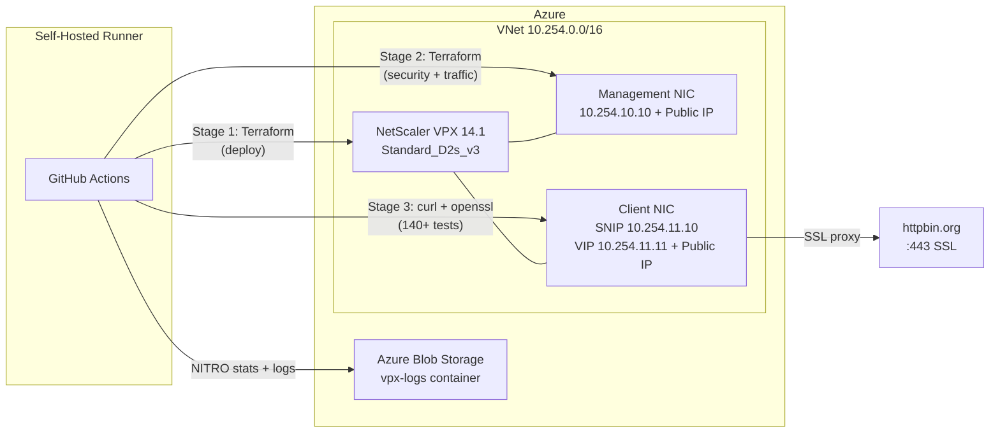

# Infrastructure Testing as Code: Quality Gates for Network Appliances

*How to prove your infrastructure is correctly configured — not just deployed*

---

Most Infrastructure as Code stops at `terraform apply succeeded`. Resources exist, the cloud console shows green checkmarks, and the pipeline moves on. But **existence is not correctness**. A load balancer can be deployed with the wrong cipher suites. A security header policy can exist but not be bound to the right vserver. A bot-blocking rule can be configured in Terraform but silently fail to block anything.

This gap is worse with network appliances. When you deploy a NetScaler VPX, F5 BIG-IP, or HAProxy, you're configuring dozens of interdependent objects — vservers, policies, profiles, certificates, bindings — where a single misconfiguration can silently degrade security or performance. You won't find out from Terraform. You'll find out from users, or from an auditor.

This repo demonstrates a pattern that closes that gap: **deploy, configure, then prove it works** — with automated tests and quality gates that fail the CI pipeline when infrastructure doesn't meet its contract.

## Architecture



The pipeline runs in three stages, each a separate GitHub Actions job:

| Stage | Terraform Module | What It Does |
|-------|-----------------|-------------|
| **Deploy** | `terraform/deploy/` | VNet, subnets, NSGs, VPX VM, dual NICs, public IPs, Lab CA + wildcard cert |
| **Configure** | `terraform/security/` + `terraform/traffic/` | Features, profiles, hardening, LB vservers, certs, headers, bot blocking |
| **Test & Report** | `scripts/run-comprehensive-tests.sh` | 22 test sections, 9 quality gates, NITRO stats collection, Azure Blob upload |

The VPX runs on a self-hosted runner — no cloud-hosted runners touching your Azure subscription. Terraform state lives in Azure Blob Storage, created automatically on first run. TLS certificates are generated by Terraform's TLS provider (lab CA + wildcard), so no external PKI dependency.

## What Gets Tested

The test suite is a single bash script (`scripts/run-comprehensive-tests.sh`) that queries the VPX NITRO API and makes live HTTP requests. It covers four categories:

### Configuration Validation (Sections 1–12)

Every Terraform-managed object is verified via NITRO API. Not "does the resource exist" — but "does the field have the exact value Terraform set":

```bash
# Verify the HTTP profile drops invalid requests
check "HTTP drop invalid" "nshttpprofile/nshttp_hardened" "dropinvalreqs" "ENABLED"

# Verify TCP profile uses CUBIC congestion control
check "TCP congestion: CUBIC" "nstcpprofile/nstcp_hardened" "flavor" "CUBIC"

# Verify each cipher suite is bound to the vserver
for cipher in "TLS1.3-AES256-GCM-SHA384" "TLS1.2-ECDHE-RSA-AES256-GCM-SHA384"; do
    # ... query sslvserver_sslciphersuite_binding ...
done
```

This catches drift, partial applies, and provider bugs. If Terraform says it set `http2maxconcurrentstreams = 128` but the VPX actually has 100, the test fails.

**What's validated**: features (6), modes (5), system parameters (6), HTTP profile (8 fields), TCP profile (14 fields), timeouts (3), SNIP, SSL certificates (7 checks), backend health, LB vserver config (9 checks), all rewrite/responder policies (16), bot patterns (9 signatures), cipher suite bindings (4).

### Functional Testing (Sections 13–14)

Live HTTP requests through the VIP public IP, not the management API:

```bash
# Does the VIP actually serve traffic?
curl -sk "https://${VIP}/get"    # expect 200

# Does HTTP→HTTPS redirect work?
curl -s "http://${VIP}/"         # expect 301

# Are security headers in the response?
curl -sk -I "https://${VIP}/get" | grep "Strict-Transport-Security"
```

The test validates 7 security headers are present (HSTS, CSP, X-Frame-Options, X-Content-Type-Options, X-XSS-Protection, Referrer-Policy, Permissions-Policy) and 2 headers are removed (Server, X-Powered-By).

### Security Testing (Sections 15–16)

SSL certificate probing with `openssl s_client` verifies key size (>= 2048 bit), protocol version (TLS 1.2+), signature algorithm, and chain depth. Then 9 attack tools are simulated:

```bash
for UA in "sqlmap/1.6" "nikto/2.1.6" "nmap scripting engine" "nuclei/2.9.4" \
          "masscan/1.3.2" "dirbuster/1.0" "gobuster/3.5" "wpscan/3.8" "ZmEu"; do
    CODE=$(curl -sk -H "User-Agent: $UA" "https://${VIP}/get" -w "%{http_code}")
    # expect 403 for every attack tool
done
```

### Performance Testing (Sections 17–22)

Single-request timing breakdown (DNS, TCP, TLS, TTFB), 20-request percentile distribution, 50 concurrent requests (10 parallel x 5 rounds), 100-request sustained burst, and 30-request mixed-method workload:

```
  Metric          Min      Avg      P50      P95      P99      Max
  ────────     ──────   ──────   ──────   ──────   ──────   ──────
  TCP          14.2ms   16.8ms   15.9ms   22.1ms   25.3ms   25.3ms
  TLS          31.5ms   38.2ms   36.1ms   49.7ms   52.4ms   52.4ms
  TTFB        185.3ms  221.6ms  212.8ms  298.4ms  315.2ms  315.2ms
  TOTAL       186.1ms  222.4ms  213.5ms  299.1ms  316.0ms  316.0ms
```

## Quality Gates — The Key Innovation

Not all test failures are equal. A missing `X-XSS-Protection` header is a finding. A VIP that doesn't respond is a **pipeline-breaking event**. Quality gates make this distinction explicit:

```bash
# Regular failure — logged but doesn't fail the pipeline
fail() { FAILED=$((FAILED+1)); ... }

# Quality gate — fails the pipeline with a non-zero exit code
gate_fail() { fail "$1" "$2" "$3"; GATES_FAILED=$((GATES_FAILED+1)); }
```

The pipeline enforces 9 quality gates:

| Gate | Threshold | Why It Matters |
|------|-----------|---------------|
| VIP health check | HTTP 200 | VIP must serve traffic |
| HTTP→HTTPS redirect | HTTP 301 | Security: no plaintext |
| TCP connect | < 500ms | Network reachability |
| TLS handshake | < 1,000ms | Certificate/cipher config |
| Time to First Byte | < 3,000ms | Backend connectivity |
| Total response | < 5,000ms | End-to-end path |
| P95 TTFB (20 requests) | < 5,000ms | Consistency under load |
| Concurrent load (50 req) | >= 95% success | Handles parallelism |
| Burst load (100 req) | >= 95% success | Sustained throughput |

The script exits with the gate breach count as its exit code. Zero gates breached = pipeline passes. Any breach = pipeline fails:

```bash
# Exit non-zero if any quality gate was breached
exit "$GATES_FAILED"
```

A passing pipeline means your infrastructure **provably** meets its performance and correctness contract — not just that Terraform finished without errors.

## Observability — Collecting Evidence

After tests complete, the pipeline collects a forensic snapshot from the VPX via NITRO API and uploads it to Azure Blob Storage:

**What's collected:**
- NITRO stats: system CPU/memory, HTTP/TCP/SSL counters, LB vserver hit counts
- NITRO config: all vservers, service groups, servers, SSL config, rewrite/responder policies, features, modes
- `ns.log`: VPX syslog with HTTP transaction records
- Test results: full test output with pass/fail/gate status

**Where it goes:**
```
Azure Blob: stvpxdiag{suffix}/vpx-logs/run-{run_id}/{timestamp}/
├── stat-ns.json
├── stat-lbvserver.json
├── stat-servicegroup.json
├── config-lbvserver.json
├── config-sslvserver.json
├── config-rewritepolicy.json
├── ...
├── ns.log
└── test-results.log
```

Every pipeline run produces a complete audit trail. When something changes between runs, you can diff the config snapshots and correlate with the test results.

## Making It Your Own

The pattern is portable. The test framework is bash + curl + python one-liners — no special tooling required. To adapt it for other appliances:

**F5 BIG-IP**: Replace NITRO API calls with iControl REST (`/mgmt/tm/ltm/virtual`). Same pattern — query the config API, assert field values.

**HAProxy**: Query the stats socket or Runtime API. Verify backends are UP, check ACL bindings, validate SSL configuration.

**Nginx/Envoy**: Use the admin API or parse config files. Test with the same curl-based functional and performance sections.

**Adjusting quality gates**: The thresholds should match your SLAs. If your users expect P95 TTFB under 500ms, set the gate there. The point is to encode your requirements as executable tests.

**Adding test sections**: The framework makes it trivial to add new sections. Each section is a self-contained block:

```bash
section "23. Your New Tests"
check "Rate limiting" "responderpolicy/pol_rate_limit"
# ... add your assertions ...
```

## Quick Start

### Prerequisites

- Azure subscription with a service principal (`Contributor` role)
- Self-hosted GitHub Actions runner with: Terraform, Azure CLI, Python 3, OpenSSL, curl
- GitHub repo with secrets configured (see below)

### 1. Fork and Configure

```bash
git clone https://github.com/YOUR_ORG/netscaler-azure-vpx.git
cd netscaler-azure-vpx
```

Set these GitHub repository secrets:

| Secret | Purpose |
|--------|---------|
| `ARM_CLIENT_ID` | Azure service principal app ID |
| `ARM_CLIENT_SECRET` | Azure service principal password |
| `ARM_TENANT_ID` | Azure AD tenant ID |
| `ARM_SUBSCRIPTION_ID` | Azure subscription ID |
| `NSROOT_PASSWORD` | VPX admin password (you choose) |
| `RPC_PASSWORD` | VPX RPC node password (you choose) |

### 2. Deploy

Push to `main` or trigger the workflow manually from GitHub Actions. The pipeline:

1. Accepts Azure marketplace terms for NetScaler VPX 14.1 BYOL
2. Creates VNet, subnets, NSGs, public IPs, storage account
3. Deploys VPX VM with dual NICs + auto-generated TLS certificates
4. Waits for NITRO API to become available
5. Applies security hardening (features, modes, profiles, system params)
6. Configures traffic (certs, backend, vservers, headers, bot blocking)
7. Runs 22 test sections with 9 quality gates
8. Collects NITRO stats + logs → Azure Blob Storage

Total pipeline time: ~20 minutes.

### 3. Review Results

Test output streams directly to GitHub Actions logs. Quality gate breaches are marked clearly:

```
  FAIL   VIP HTTPS /get  [expected: 200, got: 000]
  GATE   ^^^ QUALITY GATE BREACH ^^^
```

A clean run ends with:

```
===========================================================================
  TEST SUMMARY
===========================================================================

  Total:           140
  Passed:          138
  Failed:          0
  Warnings:        2
  Quality Gates:   0

  RESULT: ALL TESTS PASSED
===========================================================================
```

## Project Structure

```
.github/workflows/
  deploy.yml                       3-stage pipeline (deploy → configure → test & report)

terraform/
  deploy/                          VNet, subnets, NSGs, VPX VM, NICs, public IPs, TLS certs, storage
  security/                        Features, modes, system params, HTTP/TCP profiles, timeouts
  traffic/                         Certs, backend, LB vservers, SSL, headers, bot blocking, logging

scripts/
  run-comprehensive-tests.sh       22 test sections, 9 quality gates, 140+ assertions
```

## Security

- **TLS**: 1.2/1.3 only, 4 AEAD cipher suites (ECDHE-RSA-AES256/128-GCM-SHA384/256, AES256/128-GCM-SHA384/256)
- **Headers**: HSTS (1 year), CSP, X-Frame-Options DENY, X-Content-Type-Options, Referrer-Policy, Permissions-Policy
- **Bot blocking**: 9 attack tool signatures → HTTP 403
- **VPX hardening**: Strong passwords, session timeout, HTTP/TCP profile hardening, SYN flood protection
- **Credentials**: All passwords via GitHub Secrets, TLS certs auto-generated — zero secrets in the repo
